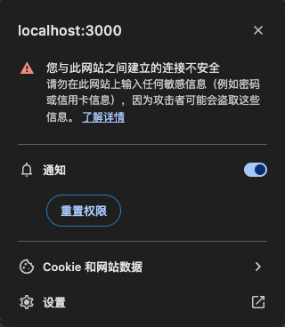
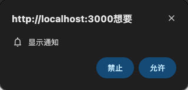
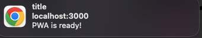

# PWA-TEST

渐进式`WAB APP`

[入门](https://learn.microsoft.com/zh-cn/microsoft-edge/progressive-web-apps/how-to/)

## 使用示例

1. 创建`index.html`

```html
<!DOCTYPE html>
<html lang="zh-CN" dir="ltr">
  <head>
    <meta charset="UTF-8" />
    <meta name="viewport" content="width=device-width,initial-scale=1" />
    <link rel="shortcut icon" href="https://c.s-microsoft.com/favicon.ico?v2" />
    <title>Temperature converter</title>
  </head>
  <body>
    <h1>Temperature converter</h1>
  </body>
</html>
```

2.  创建`web`应用的元数据清单文件`manifest.json`

```json
{
  "lang": "en-us",
  "name": "Temperature converter app",
  "short_name": "Temperature converter",
  "description": "A basic temperature converter application that can convert to and from Celsius, Kelvin, and Fahrenheit",
  "start_url": "/",
  "background_color": "#2f3d58",
  "theme_color": "#2f3d58",
  "orientation": "any",
  "display": "standalone",
  "icons": [
    {
      "src": "/images/pwa.png",
      "sizes": "192x192"
    }
  ]
}
```

3. 制作图标文件  
   可使用[工具网站](https://www.canva.com/)创建图片
4. 添加`manifest.json`引用到`index.html`  
   `<link rel="manifest" href="/manifest.json">`
5. 创建`service-work.js`  
    `service-work`中的 `install` 听事件，该事件在用户安装应用时触发，并使用它来缓存应用脱机运行所需的资源，例如初始 `HTML`、`JavaScript`、 `CSS` 文件。  
   该代码还会截获 `fetch` 每次应用向服务器发送请求时发生的事件，并应用缓存优先策略。 服务辅助角色返回缓存的资源，以便你的应用可以脱机工作，如果失败，则尝试从服务器下载。
6. 注册`service-work`  
   打开 `index.html` 并在标记末尾 `<body>` 添加以下代码，以注册服务辅助角色

```html
<script>
  if ("serviceWorker" in navigator) {
    navigator.serviceWorker.register("/sw.js", { scope: "/" });
  }
</script>
```

7. 使用 `http-server` `Node.js` 库启动服务器  
   `npx browser-sync start --server --files "**/*.html, **/*.css, **/*.js"`，访问地址`http://localhost:3000`

## 相关技术

### 1. `Notification`网页通知

1. `Notification.permission`查询权限

- `default`需要授权
- `denied`拒绝
- `granted`已授权

2. 获取用户授权

```js
Notification.requestPermission().then((permission) => {
  if (permission === "granted") {
    new Notification("title", {
      body: "PWA is ready!",
    });
  }
});
```

  
  
3. 显示通知

```js
new Notification("title", {
  body: "PWA is ready!",
});
```



### 2. `navigator`

1. `navigator.onLine`判断是否有网
2. `window.addEventListener("online", ()=>{}})`监听是否有网

### 3. `fetch`

```js
fetch("https://api.github.com")
  .then((response) => {
    return response.json();
  })
  .then((data) => {
    console.log(data);
  });
```
